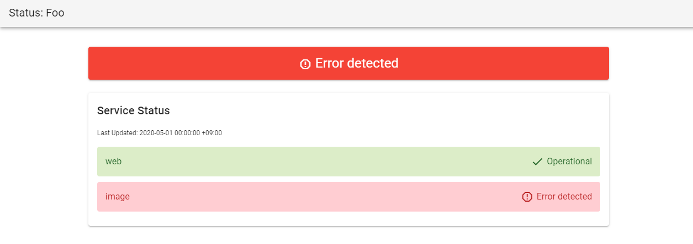

# starium-frontend

## Overview

Starium is a tool that allows you to publish the status of a particular service.  
The goal is to be able to operate without having a dedicated server.

Image:

## Usage

WIP.

## Install

WIP.

## Road map

WIP.

## Contribution

WIP.

## Licence

[MIT](https://github.com/tri-star/starium-frontend/blob/master/LICENSE)

## Author

[tri-star](https://github.com/tri-star)
